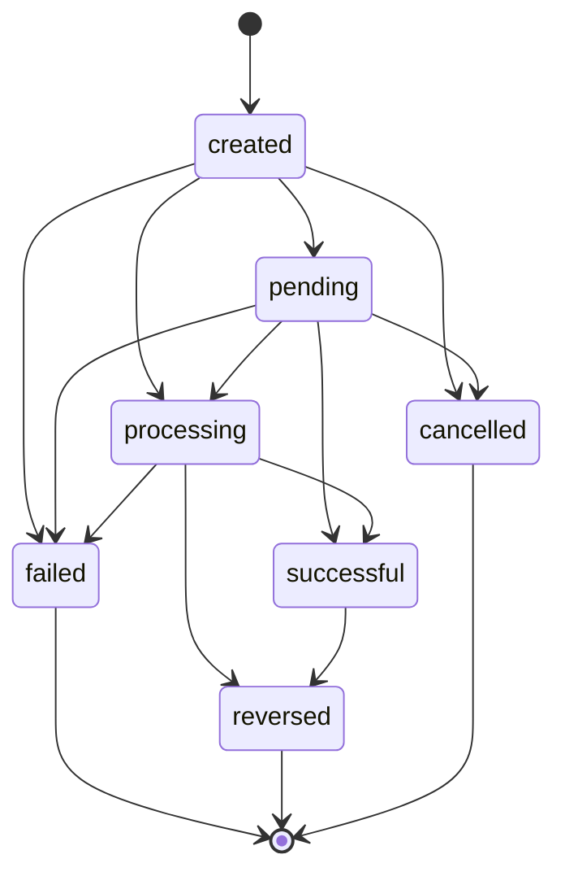

# Ricarut Webhook Architecture & Transfer Status Synchronization

This document outlines the design, security specifications, and operational guides for external provider webhook ingestion and transfer status synchronization in Ricarut.

---

## 1. Architectural Overview

When an outbound transfer is initiated in Ricarut, the immediate API response reflects the initial state (`processing` or `pending`). Because bank transfers in clearing systems (such as NIBSS in Nigeria) process asynchronously, Ricarut relies on provider webhooks and fallback active status verification to reconcile final states.

```text
External Provider (Paystack)
          │
          │ POST /v1/webhooks/paystack
          ▼
┌───────────────────────────────────────────────┐
│              Ricarut API Pipeline             │
├───────────────────────────────────────────────┤
│ 1. Raw Body Buffer Preservation (req.rawBody) │
│ 2. Webhook Route Router (Public / No API Key) │
│ 3. Cryptographic Signature Verification (HMAC)│
│ 4. Provider Event Normalization               │
│ 5. Database Idempotency Deduplication Check   │
│ 6. Transfer Lookup by Provider / Ricarut Ref  │
│ 7. Transfer State Machine Validation          │
│ 8. Atomic Status Mutation & Audit Log         │
└───────────────────────────────────────────────┘
          │
          ▼
   Developer Query (GET /v1/transfers/:id)
```

---

## 2. Webhook Endpoint Specification

- **Method**: `POST`
- **Path**: `/v1/webhooks/paystack` (or `/v1/webhooks/:provider`)
- **Authentication**: None (no `Authorization` or `x-api-key` header required)
- **Security**: Validated exclusively via HMAC-SHA512 cryptographic signature header `x-paystack-signature`.

---

## 3. Cryptographic Signature Verification

All incoming webhooks from Paystack must be verified against the configured `PAYSTACK_SECRET_KEY`:

1. **Raw Body Integrity**: The express JSON parser captures the exact unaltered raw byte buffer (`req.rawBody`) before parsing into JavaScript objects.
2. **HMAC Calculation**: An HMAC is computed using algorithm `sha512` over the raw payload buffer with the secret key:
   $$\text{HMAC-SHA512}(K_{\text{secret}}, \text{payload}_{\text{raw}})$$
3. **Timing-Safe Comparison**: The computed digest is compared against the incoming `x-paystack-signature` using `crypto.timingSafeEqual` to eliminate timing side-channel attacks.
4. **Secret Protection**: Provider secret keys and raw request bodies containing sensitive details are never written to operational application logs.

---

## 4. Supported Event Types

| Event Name | Provider Status | Ricarut Transfer Status | Action Taken |
| :--- | :--- | :--- | :--- |
| `transfer.success` | `success` | `successful` | Updates status, sets `completedAt`, records audit transaction |
| `transfer.failed` | `failed` | `failed` | Updates status, captures `failureCode` & `failureMessage` |
| `transfer.reversed` | `reversed` | `reversed` | Updates status, marks transfer as reversed |
| Other (e.g. `charge.success`) | Any | *Unchanged* | Safely acknowledged with HTTP 200 OK (`action: "ignored"`) |

---

## 5. Transfer State Machine Rules

Ricarut enforces strict state machine rules to guarantee data integrity and prevent status regressions:



### Transition Matrix

- **Allowed Active Transitions**:
  - `created` $\rightarrow$ `pending`, `processing`, `failed`, `cancelled`
  - `pending` $\rightarrow$ `processing`, `successful`, `failed`, `cancelled`
  - `processing` $\rightarrow$ `successful`, `failed`, `reversed`
  - `successful` $\rightarrow$ `reversed`
- **Forbidden Regressions**:
  - `successful` $\rightarrow$ `pending` (Rejected)
  - `successful` $\rightarrow$ `processing` (Rejected)
  - `successful` $\rightarrow$ `failed` (Rejected)
  - `failed` $\rightarrow$ `successful` (Rejected)
  - `reversed` $\rightarrow$ `successful` (Rejected)
  - Terminal states (`failed`, `reversed`, `cancelled`) cannot transition anywhere.

---

## 6. Idempotency & Deduplication

Providers often re-send webhooks when network timeouts occur or acknowledgment takes longer than their internal threshold.

1. **Unique Event Keying**: Ricarut persists each received event in the `WebhookEvent` table with a unique composite key `[provider, providerEventId]`.
2. **Duplicate Detection**: If an event with the same ID arrives, Ricarut skips the state machine mutation and immediately returns:
   ```json
   {
     "status": "success",
     "result": "ignored"
   }
   ```
3. **Concurrency Protection**: If concurrent webhook deliveries arrive simultaneously, a unique database constraint violation (`P2002`) is caught gracefully and treated as an idempotent success.

---

## 7. Developer Query & Verification Endpoints

### Querying Transfer Status

Developers inspect the current Ricarut-owned status:

```bash
GET /v1/transfers/:id
Authorization: Bearer rc_test_...
```

**Response**:
```json
{
  "data": {
    "id": "txn_ric_9b2e04f1234567890123456789abcdef",
    "reference": "payout_order_1001",
    "amount": 500000,
    "currency": "NGN",
    "status": "successful",
    "bank_code": "058",
    "account_number": "0123456789",
    "account_name": "ALEXANDER TEST",
    "provider": "paystack",
    "created_at": "2026-09-30T10:45:00.000Z",
    "updated_at": "2026-09-30T10:46:12.000Z"
  },
  "requestId": "req_84128f72-91ef-4bb2-b68a-ef8b89d81640"
}
```

### Fallback Active Verification

If a webhook is delayed, developers can actively trigger provider status reconciliation:

```bash
POST /v1/transfers/:id/verify
Authorization: Bearer rc_test_...
```

---

## 8. Testing Webhooks Locally

You can test webhook callbacks locally by calculating the HMAC-SHA512 signature using Node.js:

### Compute Signature Script

```javascript
const crypto = require("crypto");

const secret = "sk_test_a3daa64cd60969870cbdf3ce3d6b2f22daa019a4";
const payload = JSON.stringify({
  event: "transfer.success",
  data: {
    id: 12345678,
    transfer_code: "TRF_test_transfer_code",
    reference: "txn_ric_your_transfer_id",
    amount: 500000,
    currency: "NGN",
    status: "success",
    transferred_at: new Date().toISOString()
  }
});

const signature = crypto
  .createHmac("sha512", secret)
  .update(payload)
  .digest("hex");

console.log("X-Paystack-Signature:", signature);
console.log("Payload:", payload);
```

### Curl Example

```bash
curl -X POST http://localhost:4000/v1/webhooks/paystack \
  -H "Content-Type: application/json" \
  -H "x-paystack-signature: <computed_signature_here>" \
  -d '{"event":"transfer.success","data":{"id":12345678,"transfer_code":"TRF_test_transfer_code","reference":"txn_ric_your_transfer_id","amount":500000,"currency":"NGN","status":"success"}}'
```
