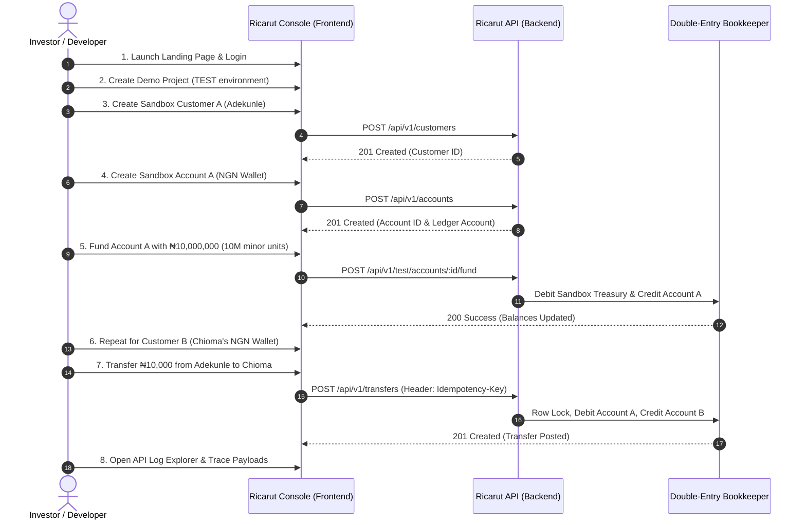

# Ricarut MVP: Investor Demo & Pitch Playbook

This document is the official, technically grounded, and verified **Investor Pitch & Demo Playbook** for the Ricarut Sandbox MVP. Every claim, capability, and roadmap item here matches our actual product architecture to survive rigorous investor due diligence.

---

## 1. Executive Summary & Pitch Configurations

### 🎯 One-Line Pitch
> "Ricarut is the developer-first financial infrastructure layer that helps African startups build and scale financial products through a single unified API."

### ⏱️ 30-Second Pitch (The Elevator Pitch)
"Integrating financial providers in Africa is fragmented and slow. To build a simple wallet with virtual accounts and payouts, a developer has to integrate separate providers, handle different API schemas, manage inconsistent response formats, and write complex ledger balances. 

Ricarut solves this. We provide a developer-first abstraction layer and sandbox infrastructure that unites multi-provider financial capabilities under one beautiful API. Right now, our Sandbox MVP is live, enabling developers to build, test, and trace multi-tenant ledgers in a simulated environment with zero friction. We are currently validating our product with early startup engineering teams as our initial target audience."

### 🎙️ 2-Minute Pitch (The Briefing Pitch)
"**[The Hook]**: Building a fintech in Africa today shouldn't require a 6-month engineering cycles just to connect different bank and wallet providers. 

**[The Problem]**: When a startup wants to build a product like a marketplace, digital wallet, or payroll system, they are forced to integrate multiple separate payment and account infrastructure providers. Each provider has its own unique API, its own authentication scheme, its own error-handling conventions, and its own operational failure modes. If a provider goes down, or if the startup needs to switch partners, their developers have to rewrite their core code from scratch.

**[The Solution]**: Ricarut is a developer-first abstraction layer for African financial infrastructure. Instead of writing separate integrations for every provider, developers integrate with Ricarut once. We unify customers, accounts, internal double-entry ledger bookkeeping, and provider routing into a single, cohesive developer experience.

**[The Product Demo]**: Our sandbox environment is fully live today. Within five minutes of signing up, a developer can create multi-tenant test projects, spin up sandbox customers and wallets, execute double-entry ledger transfers with strict concurrency and idempotency locks, trace real-time API logs, and test webhook delivery cycles.

**[The Wedge & Traction]**: Our immediate wedge is high-fidelity **sandbox financial infrastructure**. We give developers a robust, zero-friction playground to build and test their product flows before writing a single line of production banking code. We are currently at the MVP validation stage, actively engaging with developer and startup founder communities.

**[The Ask]**: We are raising an initial pre-seed round of **$150,000** to fund 12 months of runway. This will support hiring two core engineers, executing our regulatory strategy with licensed partner banks, and launching our first two production provider adapters. Join us in building the unified infrastructure layer for African fintech."

---

## 2. 10-Minute Live Demonstration Script

This repeatable, high-credibility script demonstrates the live, deployed sandbox environment. 

### 🚨 Live Reset Procedure
Before the demo starts, reset the investor's workspace to a clean, known start state.
* **How**: Run the standard seed script `scratch/reset_and_seed.ts` via the console. This wipes stale database records (customers, accounts, logs, transfers) and establishes the default sandbox datasets instantly.

---

### Step-by-Step Demo Guide

#### Slide 1: Welcome & Landing Page (0:00 - 1:30)
* **What to click**: Open browser at local console or active hosting port.
* **What to say**: 
  > "Welcome. Today, I am going to show you the developer experience of building a financial application using Ricarut. 
  > 
  > Our landing page makes our value proposition clear: we provide unified financial infrastructure for developers in Africa. Instead of fighting with multiple inconsistent APIs, we give developers a single integration point."

#### Slide 2: Developer Console & Setup (1:30 - 3:00)
* **What to click**: Click **Login**, authenticate, and enter the dashboard console. Click on the project dropdown and select the **"Demo Sandbox Project"**.
* **What to say**: 
  > "This is our Developer Dashboard. Notice that we are prominently in **TEST MODE**. Every action here is simulated, ensuring safe and compliant experimentation. 
  > 
  > Here, developers can provision separate projects—for instance, to isolate their staging and production environments. Let's look at the **API Keys** section. We can generate a new test API Key instantly. This key is securely project-scoped and never exposed to client-side bundles."

#### Slide 3: Customer and Account Provisioning (3:00 - 5:00)
* **What to click**: Go to the **Sandbox Workbench**. Fill in the quick-creation form:
  * Customer A: `Adekunle Alabi`. Click **Create**.
  * Account A: Click **Create Account**, select checking account type, currency `NGN`. Click **Save**.
  * Customer B: `Chioma Nwachukwu`. Click **Create**.
  * Account B: Click **Create Account**, checking account type, currency `NGN`. Click **Save**.
* **What to say**: 
  > "Before moving money, we need customers and financial accounts. Under the hood, Ricarut creates a customer record and provisions a corresponding wallet account. 
  > 
  > Behind this interface, the backend also automatically instantiates a corresponding **Ledger Account** in our internal double-entry system. This guarantees that every naira is strictly accounted for. Right now, Adekunle and Chioma are fully provisioned."

#### Slide 4: Sandbox Funding (5:00 - 6:30)
* **What to click**: Locate Adekunle's NGN Wallet. Click **Fund Account**. Enter amount `1000000000` (which represents 10,000,000 minor units or ₦10,000,000.00). Click **Confirm Funding**.
* **What to say**: 
  > "In a real sandbox, developers need to simulate incoming money, such as a card payment or bank deposit. We support this via our sandbox funding API. 
  > 
  > I've just added ₦10,000,000 to Adekunle's balance. On the backend, this wrote a balanced double-entry ledger journal: debiting our sandbox project treasury ledger and crediting Adekunle's ledger account. This isn't database column addition—this is professional banking-grade ledgering."

#### Slide 5: The Transfer Transaction (6:30 - 8:00)
* **What to click**: Navigate to the **Transfers** tab. Click **New Transfer**.
  * Source Account: Adekunle's Wallet.
  * Destination Account: Chioma's Wallet.
  * Amount: `1000000` (1,000,000 minor units or ₦10,000.00).
  * Click **Submit Transfer**.
* **What to say**: 
  > "Now, we will execute an internal transfer. We are transferring ₦10,000 from Adekunle's account to Chioma's account.
  > 
  > The transaction is processed instantly. Chioma's balance immediately rose, and Adekunle's balance dropped. To prevent double-spend exploits under high concurrency, the backend applies database row-level locking via PostgreSQL `SELECT FOR UPDATE`. Furthermore, we mandate an `Idempotency-Key` header on all write requests, protecting users from duplicate transfer charges if they double-click or suffer internet dropouts."

#### Slide 6: API Logs & Integration Documentation (8:00 - 10:00)
* **What to click**: Open the **API Logs** tab. Select the topmost request (`POST /transfers`). Point to the request payload details and `X-Request-ID`. Next, click on **Documentation**.
* **What to say**: 
  > "As a developer, observability is everything. If an API request fails, you shouldn't have to guess why. Our **API Log Explorer** captures every HTTP payload, response code, and execution duration, completely tied to a traceable `Request-ID`—while strictly redacting private auth tokens.
  > 
  > Finally, here is our built-in **Developer Documentation**. It has multi-language tabs showing how to execute this exact transfer in cURL, Javascript, Axios, and Python. A developer can copy this block, inject their Test API key, and successfully execute this entire flow from their own application code in minutes. This is how Ricarut turns complex banking integrations into a beautiful, standardized developer experience."

---

## 3. Regulatory & Partnership Strategy

*Ricarut is a software vendor, NOT a bank or licensed deposit taker. We do not hold customer funds directly.*

### Operational Setup
1. **Licensed Bank Partners**: Real-money assets are held in trust accounts with licensed commercial banks (under partner banking licenses).
2. **Escrow Structure**: All client treasury settlements are routed through authorized depository trustees.
3. **PCI-DSS Compliance**: The card-collection rails use host payment gateways that handle all encrypted tokenizations, removing raw card handling risk from our application servers.

---

## 4. Product Moat &moats

*   **moat 1**: Codebase integration. Once a startup designs its ledger and database entity routing schemas around Ricarut's API primitives, the cost of switching is extremely high.
*   **moat 2**: High-fidelity sandbox loops. By winning developer trust first in the sandbox development cycles, Ricarut becomes the default production payment orchestrator out-of-the-box.
